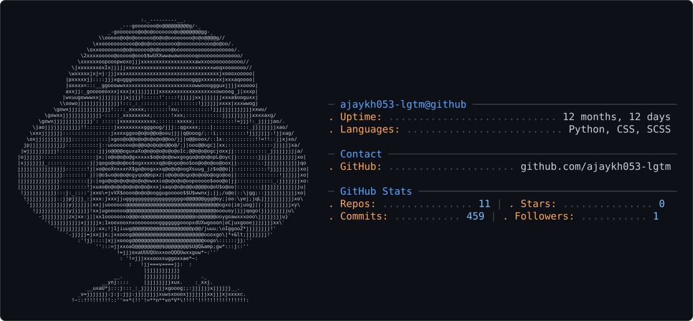

<div align="center">

<picture>
  <source media="(prefers-color-scheme: dark)" srcset="profile-card.svg" />
  <source media="(prefers-color-scheme: light)" srcset="profile-card.svg" />
  
</picture>

<!-- Typing SVG Header -->

<a href="https://git.io/typing-svg">
  
</a>


<br/>
</div>

## 🧑‍💻 About Me

```ts
const Ajay = {
  role: "Python Full-Stack Developer & CS Student",
  pronouns: "he/him",
  location: "India 🇮🇳",
  focus: ["DSA", "Full-Stack Web Dev", "Python Dev"],
  currentlyLearning: ["DSA", "Advance Python"],
  funFact: "I debug with print and I'm proud of it 🤷",
};
```

## Contribution Snake

<p align="center">
  
</p>
---

## 🛠️ Tech Stack

**Languages**


**Frontend**


**Backend & Databases**


**Tools & Platforms**


[](https://www.linkedin.com/in/ajay-kh-52b08032a/)
[](https://myprotfolio-tawny-delta.vercel.app/)
[](mailto:ajaykh053@gmail.com)
[](https://leetcode.com/u/ajaykh/)

_"First, solve the problem. Then, write the code." — John Johnson_
</div>
